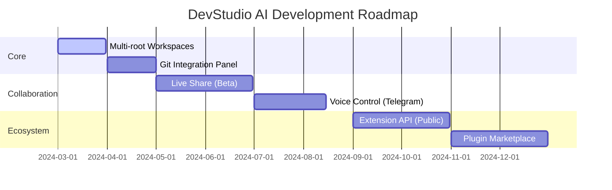

<div align="center">

  <!-- Animated Logo/Header -->
  
  
  # <span style="background: linear-gradient(135deg, #667eea 0%, #764ba2 100%); -webkit-background-clip: text; -webkit-text-fill-color: transparent;">DevStudio AI</span>
  
  ### *The Agentic IDE That Codes With You, Not Just For You*
  
  <!-- Animated Badges -->
  <p>
    
    
    
  </p>
  
  <!-- Tech Stack Badges with Animation -->
  <p>
    
    
    
    
  </p>

  <!-- Quick Action Buttons -->
  <p>
    <a href="#-quick-start">
      
    </a>
    <a href="#-architecture">
      
    </a>
    <a href="#-telegram-gateway">
      
    </a>
  </p>

</div>

---

## 🎬 What Makes It Different?

> **"It's not just an editor. It's a coding partner that understands your codebase, executes commands, and keeps you updated via Telegram—all while running locally on your machine."**

<div align="center">

| 🧠 **Autonomous Agent** | 💻 **VS Code Experience** | 📱 **Remote Control** |
|:---:|:---:|:---:|
| Thinks & acts independently | Monaco Editor + IntelliSense | Telegram integration |
| Multi-step reasoning | Full terminal integration | Real-time activity logs |
| Safe execution guards | Extension ecosystem | Mobile IDE access |

</div>

---

## ✨ Core Capabilities

### 🤖 Agentic AI Engine
```diff
+ Autonomous Code Navigation
+ Smart File Operations (Read/Write/Search)
+ Terminal Command Execution
+ Multi-step Thinking Loop
+ Context-Aware Suggestions
```
🚀 **Antigravity Powered**: Leverages Google Cloud Code Assist for superior reasoning
🛡️ **Safety First**: Built-in confirmation manager for destructive operations
🔄 **Iterative Reasoning**: Complex task breakdown with visible thought process

### 💻 Developer Experience
```diff
+ Monaco Editor (VS Code Core)
+ Xterm.js Terminal (node-pty)
+ Real-time File Watching (Chokidar)
+ Hot Module Replacement
+ Extension API (Beta)
```

### 📱 Telegram Gateway
```diff
+ Mobile IDE Control
+ Real-time Notifications
+ Task Queue Management
+ Secure Bot Integration
+ Activity Dashboard
```

---

## 🏗️ System Architecture

```plain
┌─────────────────────────────────────────────────────────────┐
│                        ELECTRON SHELL                       │
│  ┌──────────────┐  ┌──────────────┐  ┌──────────────────┐   │
│  │   React UI   │  │ Monaco Editor│  │  Xterm Terminal  │   │
│  │  (Vite+TW)   │  │              │  │                  │   │  
│  └──────────────┘  └──────────────┘  └──────────────────┘   │
└────────────────────┬────────────────────────────────────────┘
                     │ Socket.io
┌────────────────────▼────────────────────────────────────────┐
│                        NODE.JS BACKEND                      │
│  ┌──────────────┐  ┌──────────────┐  ┌──────────────────┐   │
│  │  AI Core     │  │ File System  │  │   Extension      │   │
│  │  (Antigravity)│  │   Manager    │  │     Host        │   │
│  └──────────────┘  └──────────────┘  └──────────────────┘   │ 
└────────────────────┬────────────────────────────────────────┘
                     │ HTTPS/Webhook
┌────────────────────▼────────────────────────────────────────┐
│                     TELEGRAM GATEWAY                        │
│              Secure Mobile Command Interface                │
└─────────────────────────────────────────────────────────────┘
```

---

## ⚡ Quick Start

### Prerequisites
✅ **Node.js v22+**
✅ **Git**
✅ **4GB RAM minimum**

### 🚀 One-Line Install
```bash
# Clone & Setup
git clone https://github.com/yadavnithi887-hue/v0.5.git && cd v0.5 && npm install && cd backend && npm install
```

### 🏃 Run Development
```bash
# Start everything (Frontend + Backend + Electron)
npm run start:full
```

### 🔐 Connect AI (30 seconds)
1. Open Settings (`Ctrl/Cmd + ,`)
2. Click **"Connect Google Account"**
3. OAuth flow on `localhost:51121`
4. ✅ Auto-discovered `projectId`

### 📱 Telegram Setup (2 Minutes)

<div align="center">

| Step | Action | Command |
| :--- | :--- | :--- |
| 1 | Create Bot | Message @BotFather `/newbot` |
| 2 | Get Token | Copy the API token provided |
| 3 | Get Chat ID | Message @userinfobot |
| 4 | Configure | Paste in DevStudio Settings |
| 5 | Activate | Click "Start Gateway" 🚀 |

</div>

> 💡 **Pro Tip**: Use it to start long builds while away from desk, or get notified when AI completes a complex refactoring!

---

## 🛠️ Tech Stack Deep Dive

### Frontend Layer


### Backend & Desktop


### AI & Integration


---

## 🗺️ Roadmap 2024-2025



- [x] **v0.5** - Core IDE + AI Agent + Telegram Gateway ✅
- [ ] **v0.6** - Multi-root workspaces & Git panel
- [ ] **v0.7** - Live Share & Voice commands
- [ ] **v0.8** - Public Extension API
- [ ] **v1.0** - Production Ready 🎯

---

## 📊 Project Stats

<div align="center">


</div>

---

## 🤝 Contributing

We love contributions! See our [Contributing Guide](CONTRIBUTING.md) for details.

```bash
# Fork and clone
git clone https://github.com/your-username/v0.5.git

# Create feature branch
git checkout -b feature/amazing-feature

# Commit changes
git commit -m "✨ Add amazing feature"

# Push to branch
git push origin feature/amazing-feature

# Open Pull Request
```

---

## 📄 License

Distributed under the MIT License. See `LICENSE` for more information.

<div align="center">

🌟 **Star us on GitHub** — it motivates us a lot!

Made with ❤️ by the DevStudio Team

[X.com](https://x.com/NitishYadav1947) | [E-mail](nitishyadav2976@gmail.com)

</div>

<!-- Animated footer -->
<p align="center">
  
  
  
</p>

